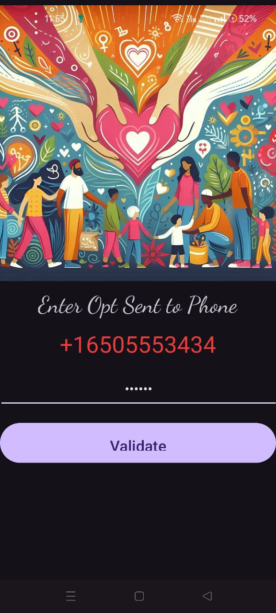

# Hope - Charity Donation App





## Overview

Hope is a comprehensive charity donation app designed to connect donors with verified charitable organizations. It facilitates:
- Verification of charitable organizations' documents.
- Donations to nearby verified charities.
- Donations for various causes, including clothes, food, books, medicines, blood, and organs.

## Features

- **Document Verification**: Charity organizations can submit their documents for verification to ensure credibility.
- **Nearby Charitable Organizations**: Users can find and donate to nearby verified charities based on their needs:
  - **Clothes**: Find and donate to orphanages or similar organizations.
  - **Food**: Support old age homes and food banks.
  - **Books**: Contribute to public libraries.
  - **Medicines**: Donate to public hospitals.
  - **Blood**: Locate and donate to blood banks.
  - **Organ Donations**: Support public hospitals for organ donations.

### HomeScreen Fragment

- **Buttons and Actions**:
  - **Clothes**: Opens Google Maps to find nearby orphanages.
  - **Food**: Opens Google Maps to locate old age homes.
  - **Books**: Opens Google Maps for public libraries.
  - **Meds**: Opens Google Maps to find public hospitals.
  - **Blood**: Opens Google Maps to locate blood banks.
  - **Organ**: Opens Google Maps for public hospitals.
  - **Gaushala**: Opens Google Maps to find nearby goshala.
  - **JKP**: Opens an external link for JKP donations.
  - **Charity Organization**: Navigates to a fragment for verified charity organizations.

## Installation

1. **Clone the Repository**:
   ```bash
   git clone https://github.com/Veerainsood/Hope.git
